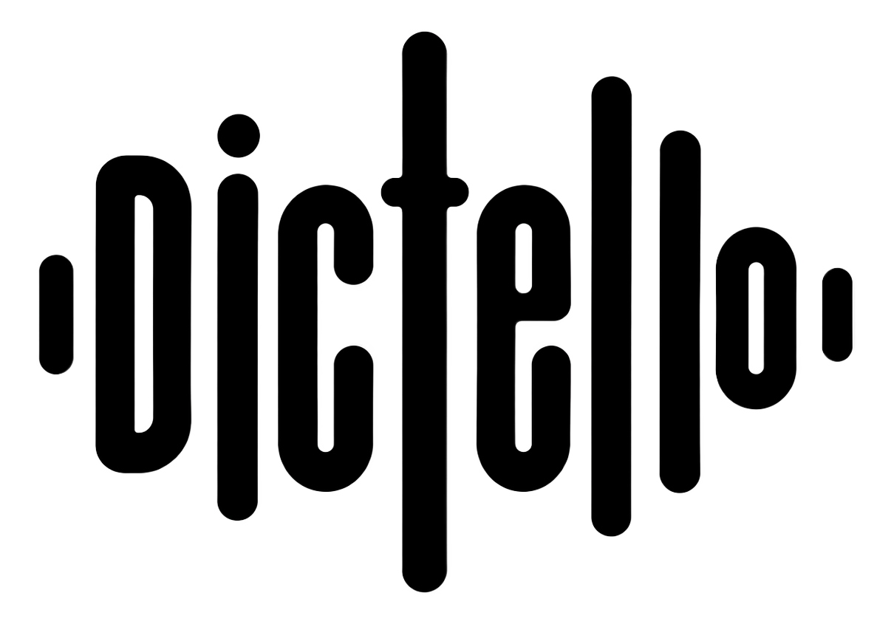

# Dictello

<p align="center">
  
</p>

<p align="center">
  <a href="#english">English</a> · <a href="#русский">Русский</a>
</p>

## English

Dictello is a private, local-first voice input and AI text assistant for Apple
Silicon Macs. Dictate into any active text field, translate speech on device,
transform selected text, or create a structured document with a local model.

### Highlights

- local dictation with Whisper Large v3 Turbo;
- Russian, English, mixed speech, and automatic language detection;
- on-device voice translation through Apple Translation;
- Command Mode for correcting, shortening, rewriting, summarizing, and
  converting selected text to Markdown;
- Compose Mode for contextual replies and structured documents;
- optional local Ollama models, including compatible models already installed
  on the Mac;
- local dictionary and optional transcript history;
- 14 interface languages, light and dark themes;
- no accounts, cloud transcription, analytics, or advertising SDKs.

### Shortcuts

| Action | Shortcut |
| --- | --- |
| Start or finish dictation | `fn` / Globe |
| Cancel recording or processing | `Escape` |
| Translate dictation | Double-press `fn` |
| Transform selected text | `fn + Space` |
| Open Compose Mode | `fn + Shift + Space` |

### Requirements

- Apple Silicon Mac;
- macOS 26 or newer;
- approximately 1.5 GB of free disk space for the bundled speech model;
- Microphone and Accessibility permissions.

The beta includes Whisper and its arm64 runtime. Homebrew, Python, CMake, and a
separate speech-model download are not required.

### Install the public beta

1. Download the DMG and matching `.sha256` file from
   [Releases](https://github.com/NekoNokoo/Dictello/releases).
2. Open the DMG.
3. Right-click `Установить Dictello.command`, choose **Open**, and confirm.
4. Grant Microphone and Accessibility access during onboarding.

This beta is currently ad-hoc signed and not notarized. macOS therefore asks
for one explicit confirmation before the first launch.

### Privacy

Speech recognition, text processing, the dictionary, and history operate on
the Mac. Temporary audio is deleted after recognition. History is local and
opt-in. Dictello accesses the network only when the user explicitly downloads
an optional model; macOS may also prepare an Apple Translation language pack.

### Verify the download

```bash
shasum -a 256 -c Dictello-0.2.0-beta.1-apple-silicon-macos26.dmg.sha256
```

Expected result:

```text
Dictello-0.2.0-beta.1-apple-silicon-macos26.dmg: OK
```

---

## Русский

Dictello — приватное локальное приложение для голосового ввода и работы с
текстом на Mac с Apple Silicon. Оно умеет вставлять диктовку в активное поле,
переводить речь на устройстве, преобразовывать выделенный текст и создавать
структурированные документы с помощью локальной модели.

### Основные возможности

- локальная диктовка на Whisper Large v3 Turbo;
- русский, английский, смешанная речь и автоматическое определение языка;
- локальный голосовой перевод через Apple Translation;
- Command Mode для исправления, сокращения, изменения стиля, резюмирования и
  преобразования выделенного текста в Markdown;
- Compose Mode для ответов по контексту и создания структурированных документов;
- опциональные локальные модели Ollama, включая совместимые модели, уже
  установленные на Mac;
- локальный словарь и опциональная история диктовок;
- 14 языков интерфейса, светлая и тёмная темы;
- без аккаунтов, облачного распознавания, аналитики и рекламных SDK.

### Горячие клавиши

| Действие | Сочетание |
| --- | --- |
| Начать или завершить диктовку | `fn` / Globe |
| Отменить запись или обработку | `Escape` |
| Перевести диктовку | Двойное нажатие `fn` |
| Преобразовать выделенный текст | `fn + Space` |
| Открыть Compose Mode | `fn + Shift + Space` |

### Требования

- Mac с Apple Silicon;
- macOS 26 или новее;
- около 1,5 ГБ свободного места для встроенной речевой модели;
- разрешения на доступ к микрофону и Универсальному доступу.

В beta уже включены Whisper и arm64-runtime. Homebrew, Python, CMake и отдельная
загрузка речевой модели не требуются.

### Установка публичной beta

1. Скачайте DMG и соответствующий файл `.sha256` в разделе
   [Releases](https://github.com/NekoNokoo/Dictello/releases).
2. Откройте DMG.
3. Нажмите правой кнопкой на `Установить Dictello.command`, выберите
   **«Открыть»** и подтвердите запуск.
4. Во время первого запуска разрешите доступ к микрофону и Универсальному
   доступу.

Текущая beta подписана ad-hoc и пока не нотариализирована Apple, поэтому перед
первым запуском macOS запросит дополнительное подтверждение.

### Приватность

Распознавание речи, обработка текста, словарь и история работают на Mac.
Временное аудио удаляется после распознавания, а локальная история по умолчанию
выключена. Dictello обращается к сети только при явной загрузке дополнительной
модели; macOS также может подготовить языковой пакет Apple Translation.

### Проверка загрузки

```bash
shasum -a 256 -c Dictello-0.2.0-beta.1-apple-silicon-macos26.dmg.sha256
```

Ожидаемый результат:

```text
Dictello-0.2.0-beta.1-apple-silicon-macos26.dmg: OK
```

## Beta feedback / Обратная связь

When reporting a problem, include the Mac model, macOS version, selected local
model, active application, and the workflow that failed. Do not attach dictated
or selected text unless you intentionally want to share it.

При сообщении об ошибке укажите модель Mac, версию macOS, выбранную локальную
модель, активное приложение и режим, в котором возникла проблема. Не прикладывайте
текст диктовки или выделенный текст, если не хотите передавать его намеренно.
